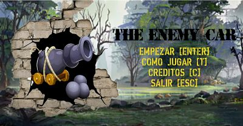

 # The enemy car
 
 
 
## Hecho por:
Ronald Fernando Páez Sarmiento 2192551

Sergio Camilo Santos uribe 
## Descripción:
En un lago en tierras prohibidas sus habitantes han decidido proteger sus aguas, para esto  han contruido un cañon evitando asi que gente maligna llegue en sus vehiculo a robar y contaminarlas.
## Clasificación por edades:
Para toda la familia.

## Tipo de juego:
Acción.
## Requisitos:
* Librería processing.sound

* Archivo de letra .ttf

## Créditos:
* https://huaban.com/ plataforma para descargan ilustraciones

* https://www.freepng.es/ plataforma para descargar imagenes png

* https://freesound.org/ plataforma para descargar audios

* https://fonts2u.com/ plataforma para descargar fuentes

* Usuario font-face de fonts2u.com, creador de la fuente ''napalm vergio''

* Usuario LECTER_JOHNSON de fonts2u.com, creador de la fuente ''XXII-ARMY''
 
* Usuario DDmyzik de freesound.org, creador del audio del menu
 
* Usuario FoolBoyMedia de freesound.org, creador del audio del gameplay

* Usuario _petal de huaban.com, creador de la imagen de fondo
